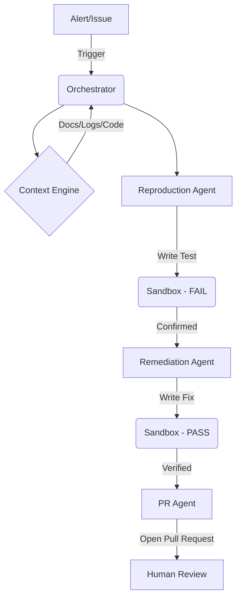

# OpsGuard Architecture (Hackathon Edition)

**Goal:** Autonomous remediation of infrastructure incidents with verified proof.
**Core Principle:** "Don't just fix it—prove it."

## 1. System Overview

OpsGuard is an event-driven agent loop. It does not just "chat"; it *acts*.



## 2. Core Components

### A. The Orchestrator (Brain)
*   **Tech:** Python + LangGraph.
*   **Role:** Managing the state of the incident.
*   **State Schema:**
    ```python
    class IncidentState(TypedDict):
        issue_description: str
        reproduction_script: str
        fix_code: str
        test_results: dict
        status: Literal["detecting", "reproducing", "fixing", "verifying", "pr_open"]
    ```

### B. The Sandbox (Muscle)
*   **Tech:** Docker (Ephemeral Containers).
*   **Implementation:**
    *   Spins up a fresh container for *every* execution.
    *   Mounts the source code (read-only volume).
    *   Executes the `reproduction_script` or `test_script`.
    *   Captures `stdout`, `stderr`, and exit codes.
    *   **Security:** `network_mode="none"` (unless fetching dependencies), `mem_limit="512m"`.

### C. The Context Engine (Memory)
*   **Tech:** ChromaDB (Local Vector Store) + Simple Git Search.
*   **Role:** "How do I fix this?"
*   **Data Sources:**
    1.  **Codebase:** The actual repo files (chunked).
    2.  **Docs:** `README.md`, `docs/`.
    3.  **Past Incidents:** "We saw this error 3 weeks ago."

## 3. The "Validation Loop" (The Secret Sauce)

This is what wins the hackathon. We do not trust the LLM's code blindly.

1.  **Phase 1: Reproduction (The "Red" Step)**
    *   Agent analyzes the error log.
    *   Agent generates a Python/Bash script that *should* fail if the bug exists.
    *   **Sandbox Run:** If it fails -> **Success** (Bug Reproduced). If it passes -> **Fail** (Hallucination).

2.  **Phase 2: Remediation (The "Green" Step)**
    *   Agent generates a patch.
    *   **Sandbox Run:** Run `reproduction_script` again with the patch applied.
    *   **Constraint:** The script must now PASS (Exit Code 0).

3.  **Phase 3: Regression (Optional)**
    *   Run existing unit tests to ensure no regressions.

## 4. Directory Structure

```
opsguard/
├── agents/             # LangGraph Nodes
│   ├── orchestrator.py
│   ├── reproduction.py
│   ├── remediation.py
│   └── pr.py
├── sandbox/            # Docker Interface
│   ├── runner.py       # "class DockerSandbox"
│   └── Dockerfile.base
├── context/            # RAG Logic
│   └── retriever.py
├── utils/
│   └── github.py
├── main.py
└── requirements.txt
```

## 5. Future Enterprise Path (Post-Hackathon)

*   **Sandbox:** Swap Docker for **Firecracker MicroVMs** or **E2B** for isolation.
*   **Auth:** Add GitHub App authentication + RBAC.
*   **UI:** Next.js Dashboard for live execution logs.
